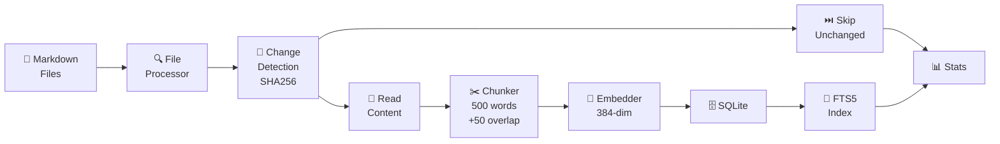
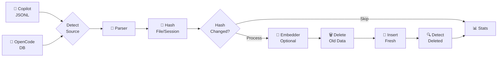
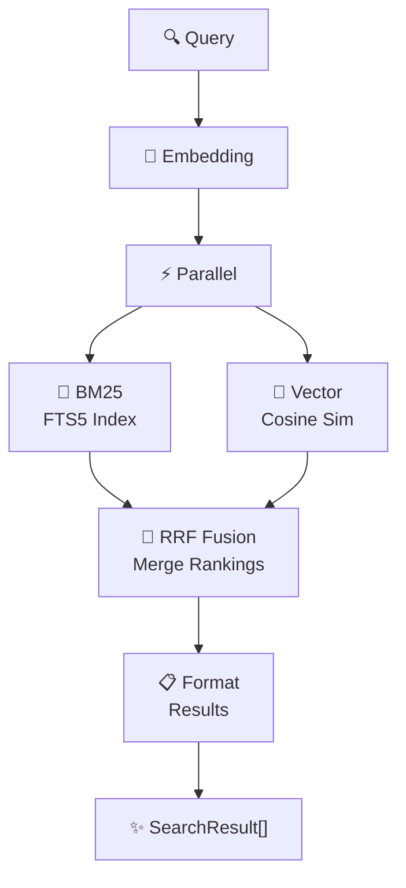
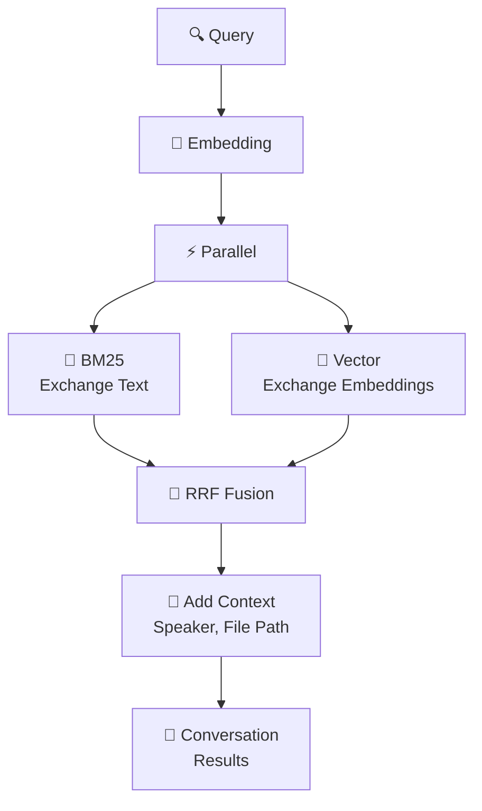

# Data Flows

Visual reference for how data moves through the Context Cache system during indexing and searching operations.

## Indexing Operations

### Knowledge Base Indexing

The KB indexer processes markdown files into searchable chunks:

1. **Discovery** - Find all `.md` files recursively
2. **Change Detection** - Compare SHA256 hash with database
3. **Skip or Process** - If unchanged, skip; if changed, process
4. **Chunking** - Split into 500-word chunks with 50-word overlap
5. **Embedding** - Generate 384-dim vectors (local model)
6. **Storage** - Insert chunks and embeddings into SQLite
7. **Indexing** - Populate FTS5 full-text search index
8. **Cleanup** - Remove old data for changed files

**Key Principle:** Only reprocess changed files (hash-based change detection)



### Conversation Indexing

The conversation indexer extracts exchanges from Copilot or OpenCode:

1. **Detection** - Identify source (JSONL or OpenCode DB)
2. **Parsing** - Extract conversation and exchanges
3. **Hashing** - Compute SHA256 of file/session
4. **Deduplication** - Skip if unchanged
5. **Embedding** - Generate vectors for exchanges (optional)
6. **Cleanup** - Delete all old exchanges (remove orphans)
7. **Storage** - Insert fresh exchanges with embeddings
8. **Deletion** - Remove conversations no longer in source

**Key Principle:** Full cleanup before re-adding (no partial updates)



## Search Operations

### Knowledge Base Search

Hybrid search combining keyword and semantic matching:

1. **Query Embedding** - Generate vector for search query
2. **Parallel Search**:
   - **BM25** - SQLite FTS5 keyword matching with stemming
   - **Vector** - Cosine similarity across all embeddings
3. **Result Fusion** - Merge rankings with Reciprocal Rank Fusion (RRF)
4. **Formatting** - Look up file paths, normalize scores
5. **Return** - Top N results with combined scores

**Result Quality:** Better than either method alone



### Conversation Search

Find relevant exchanges across Copilot and OpenCode:

1. **Query Embedding** - Generate vector for search query
2. **Parallel Search**:
   - **BM25** - Full-text search on exchange text
   - **Vector** - Similarity search on exchange embeddings
3. **Result Fusion** - Merge rankings with RRF
4. **Context Lookup** - Get conversation file path, speaker info
5. **Return** - Exchanges with context and relevance

**Output:** Searchable conversation excerpts with metadata



## Data Storage

### Database Layout

```
┌─────────────────────────────────────────┐
│ SQLite Database                         │
├─────────────────────────────────────────┤
│                                         │
│  files table                            │
│  ├─ id, path, hash, indexed_at          │
│                                         │
│  chunks table                           │
│  ├─ id, file_id, chunk_index            │
│  ├─ content, raw_text, embedding       │
│                                         │
│  chunks_fts (FTS5 virtual)              │
│  ├─ content (indexed for BM25)         │
│                                         │
│  conversations table                    │
│  ├─ id, source, file_path, hash        │
│                                         │
│  exchanges table                        │
│  ├─ id, conversation_id, speaker       │
│  ├─ user_input, assistant_output       │
│  ├─ embedding, timestamp                │
│                                         │
└─────────────────────────────────────────┘
```

## Search Performance

### BM25 Search
- **Speed:** Fast (logarithmic FTS5 index lookup)
- **Best for:** Exact keyword matches, technical terms
- **Example:** "TypeScript interfaces" finds exact matches

### Vector Search
- **Speed:** Linear scan through all embeddings
- **Best for:** Semantic similarity, paraphrased queries
- **Example:** "type definitions" finds similar content

### RRF Fusion
- **Speed:** Merge sorted results (negligible overhead)
- **Best for:** Combined keyword + semantic recall
- **Formula:** `1/(k + rank)` where k=60

**Combined:** Balanced search across both dimensions

## Key Design Principles

### 1. Hash-Based Change Detection
- Only reprocess files/sessions whose SHA256 hash changed
- Avoids redundant work on large knowledge bases
- Significantly faster incremental indexing

### 2. Full Cleanup Before Re-Adding
- Delete ALL old chunks/exchanges before reprocessing
- Prevents orphaned data in database
- Ensures consistency with current source

### 3. Deleted Content Detection
- Every index run compares DB against current source
- Any DB record missing from source is deleted
- Keeps index synchronized with reality

### 4. Parallel Hybrid Search
- BM25 and vector search run simultaneously
- Results merged with Reciprocal Rank Fusion
- Better recall than either alone

### 5. Local Embeddings
- No API keys, rate limits, or network latency required
- Privacy-preserving (data stays local)
- Offline-capable operation

## References

- **[Full Architecture Guide](index.md)** - Complete system design
- **[Database Schema](index.md#database-schema)** - Table structure
- **[API Reference](../api.md)** - Function signatures
- **[Configuration](../configuration.md)** - Tuning parameters
